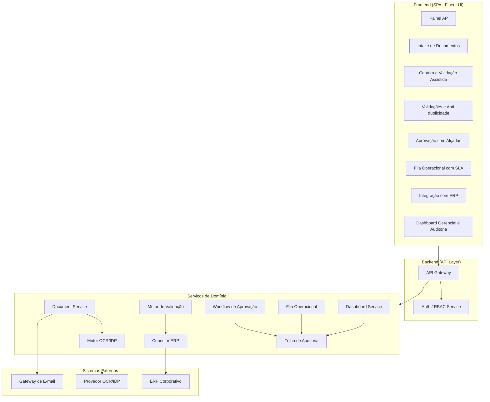
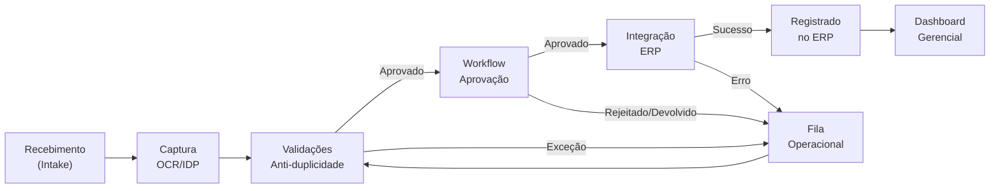
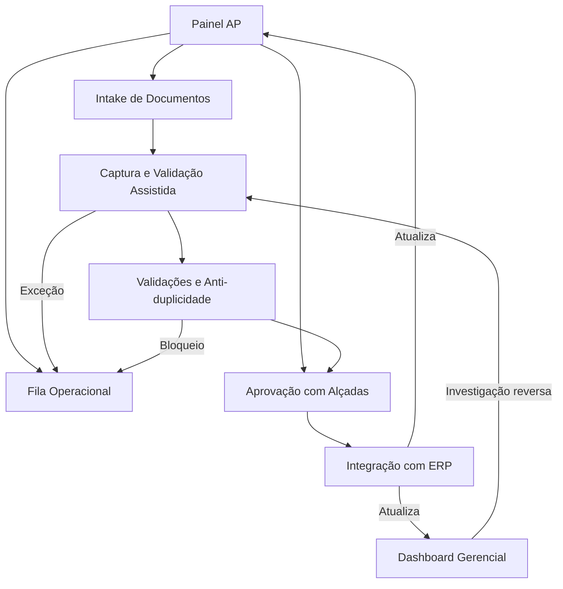

# Especificação de Design — Automação do Processo de Contas a Pagar (AP Automation)

## Visão Geral

Este documento descreve o design técnico do sistema de Automação de Contas a Pagar (AP Automation), cobrindo arquitetura, componentes, modelos de dados, propriedades de corretude e estratégia de testes. O sistema substitui o fluxo manual e fragmentado de contas a pagar por uma solução integrada que centraliza recebimento de documentos fiscais, automatiza extração e classificação via OCR/IDP, implementa workflow formal de aprovação com alçadas, integra-se ao ERP e fornece dashboards operacionais/gerenciais com trilha auditável completa.

### Visão de UX

O design segue uma abordagem centrada em exceções: itens válidos fluem com fricção mínima, enquanto casos críticos recebem ênfase visual. Quatro perfis de usuário são atendidos:

- **Analista AP** — desktop-first, uso intensivo
- **Aprovador/Gestor** — desktop + mobile
- **Tesouraria/Controladoria** — desktop, foco em dashboards e auditoria
- **Auditoria** — desktop, foco em rastreabilidade

O sistema adere ao Fluent Design System e conformidade WCAG 2.1 AA.

### Princípios de Design

1. **Prioridade por risco e vencimento** — itens mais críticos sempre no topo
2. **Exceção destacada, rotina em fluxo rápido** — o que está ok flui; o que precisa de atenção grita
3. **Contexto antes da decisão** — toda informação necessária visível antes de qualquer ação
4. **Rastreabilidade visível** — trilha auditável acessível em qualquer ponto
5. **Consistência operacional** — padrões visuais e de interação uniformes
6. **Acessibilidade por padrão** — contraste AA, navegação por teclado, compatibilidade com leitores de tela

## Arquitetura

### Visão de Alto Nível

O sistema é composto por uma camada de frontend (SPA), uma camada de API (backend), serviços de domínio, e integrações externas.



### Fluxo Principal do Processo



### Decisões Arquiteturais

| Decisão | Escolha | Justificativa |
|---------|---------|---------------|
| Frontend Framework | React + Fluent UI v9 | Alinhamento com Fluent Design System, componentes acessíveis nativos |
| State Management | Zustand ou Redux Toolkit | Gerenciamento previsível de estado complexo (filas, workflows) |
| API Layer | REST com OpenAPI | Interoperabilidade com ERP, documentação automática |
| Autenticação | OAuth 2.0 / OIDC + RBAC | Padrão corporativo, suporte a perfis e segregação de funções |
| Trilha de Auditoria | Append-only store (imutável) | Conformidade regulatória, imutabilidade garantida |
| OCR/IDP | Serviço externo via API | Flexibilidade de provedor, escalabilidade independente |
| Banco de Dados | PostgreSQL + tabela de auditoria append-only | Transações ACID, suporte a JSON, maturidade |
| Criptografia | TLS 1.2+ em trânsito, AES-256 em repouso | Requisitos de segurança (Req. 9.4, 9.5) |

## Componentes e Interfaces

### 1. Document Service (Serviço de Documentos)

Responsável pelo ciclo de vida do documento fiscal desde o recebimento até o arquivamento.

**Interface:**
```typescript
interface IDocumentService {
  // Recebimento
  receiveDocument(file: File, channel: DocumentChannel): Promise<DocumentReceipt>;
  receiveBatch(files: File[], channel: DocumentChannel): Promise<DocumentReceipt[]>;
  
  // Consulta
  getDocument(protocoloUnico: string): Promise<DocumentoFiscal>;
  listDocuments(filters: DocumentFilters): Promise<PaginatedResult<DocumentoFiscal>>;
  
  // Classificação
  classifyDocument(protocoloUnico: string): Promise<DocumentType>;
}

type DocumentChannel = 'email' | 'upload' | 'api';
type DocumentType = 'nota_fiscal' | 'boleto' | 'fatura';

interface DocumentReceipt {
  protocoloUnico: string;
  dataRecebimento: Date;
  canalOrigem: DocumentChannel;
  tipoDocumento: DocumentType;
  status: DocumentStatus;
}

interface DocumentFilters {
  status?: DocumentStatus;
  fornecedor?: string;
  dataVencimentoInicio?: Date;
  dataVencimentoFim?: Date;
  faixaValorMin?: number;
  faixaValorMax?: number;
  etapa?: ProcessStage;
  page: number;
  pageSize: number;
}
```

**Validações de entrada:**
- Formatos aceitos: PDF, XML, JPEG, PNG
- Tamanho máximo: 25 MB por arquivo
- Rejeição com mensagem descritiva para formatos/tamanhos inválidos

### 2. Motor OCR/IDP (Serviço de Extração)

Responsável pela extração inteligente de dados estruturados a partir de documentos fiscais.

**Interface:**
```typescript
interface IOCRService {
  extractData(protocoloUnico: string, documentBuffer: Buffer): Promise<ExtractionResult>;
  getExtractionStatus(protocoloUnico: string): Promise<ExtractionStatus>;
}

interface ExtractionResult {
  protocoloUnico: string;
  campos: ExtractedField[];
  status: 'completed' | 'failed' | 'pending';
  tempoProcessamento: number; // ms
}

interface ExtractedField {
  nome: string;
  valor: string | number | Date;
  indiceConfianca: number; // 0-100
  requerRevisao: boolean; // true se indiceConfianca < 85
}
```

**Regras:**
- Processamento deve iniciar em até 60 segundos após recebimento
- Campos com `indiceConfianca < 85%` são marcados com `requerRevisao: true`
- Campos obrigatórios: CNPJ emitente, CNPJ destinatário, número do documento, data emissão, data vencimento, valor total, itens de linha, impostos

### 3. Motor de Validação

Responsável por executar regras de negócio e detecção de duplicidade.

**Interface:**
```typescript
interface IValidationService {
  validateDocument(doc: DocumentoFiscal): Promise<ValidationResult>;
  checkDuplicate(doc: DocumentoFiscal): Promise<DuplicateCheckResult>;
  resolveException(protocoloUnico: string, decision: ExceptionDecision): Promise<void>;
}

interface ValidationResult {
  protocoloUnico: string;
  regras: RuleResult[];
  aprovado: boolean; // true se todas as regras passaram
}

interface RuleResult {
  regra: string;
  status: 'aprovada' | 'reprovada';
  detalhes: string;
  criticidade: 'critica' | 'alta' | 'media' | 'baixa';
}

interface DuplicateCheckResult {
  duplicataDetectada: boolean;
  documentosSimilares: DocumentoFiscal[];
  criterios: { cnpjEmitente: boolean; numeroDocumento: boolean; valorDentroTolerancia: boolean };
}

interface ExceptionDecision {
  tipo: 'liberar' | 'rejeitar';
  justificativa: string; // obrigatória
  usuarioId: string;
}
```

**Regras de validação:**
- Consistência de CNPJ (emitente e destinatário)
- Validade da data de vencimento
- Coerência valor total vs. soma dos itens
- Existência do fornecedor no cadastro ERP
- Anti-duplicidade: mesmo CNPJ emitente + mesmo número documento + valor dentro de tolerância de 1%

### 4. Workflow de Aprovação

Gerencia o fluxo formal de aprovação com alçadas configuráveis.

**Interface:**
```typescript
interface IWorkflowService {
  submitForApproval(protocoloUnico: string): Promise<ApprovalRequest>;
  approve(protocoloUnico: string, aprovadorId: string, justificativa?: string): Promise<ApprovalResult>;
  reject(protocoloUnico: string, aprovadorId: string, justificativa: string): Promise<ApprovalResult>;
  returnForCorrection(protocoloUnico: string, aprovadorId: string, justificativa: string): Promise<ApprovalResult>;
  escalate(protocoloUnico: string): Promise<ApprovalRequest>;
  checkSoDConflict(protocoloUnico: string, userId: string): Promise<SoDCheckResult>;
}

interface ApprovalRequest {
  protocoloUnico: string;
  aprovadorDesignado: string;
  alcadaRequerida: number;
  slaLimite: Date;
  status: 'pendente' | 'aprovado' | 'rejeitado' | 'devolvido' | 'escalado';
}

interface SoDCheckResult {
  conflito: boolean;
  regrasVioladas: string[];
  mensagem: string;
}
```

**Regras:**
- Roteamento automático baseado em valor do documento vs. alçada do aprovador
- Escalação automática quando valor excede alçada
- Bloqueio por Segregação de Funções (SoD): quem registrou não aprova; quem aprovou não registra no ERP
- Justificativa obrigatória para rejeição e devolução
- Notificação de escalação quando SLA é excedido
- Aprovações fora do workflow (e-mail, WhatsApp) são bloqueadas

### 5. Fila Operacional

Organiza e prioriza itens de trabalho pendentes com rastreamento de SLA.

**Interface:**
```typescript
interface IQueueService {
  getQueue(analistaId: string, filters?: QueueFilters): Promise<PaginatedResult<QueueItem>>;
  reassignItem(protocoloUnico: string, novoAnalistaId: string): Promise<void>;
  getQueueKPIs(analistaId: string): Promise<QueueKPIs>;
}

interface QueueItem {
  protocoloUnico: string;
  fornecedor: string;
  valor: number;
  dataVencimento: Date;
  etapaAtual: ProcessStage;
  tempoDecorrido: number; // minutos
  slaStatus: 'dentro_prazo' | 'alerta' | 'vencido';
  excecao?: { tipo: string; motivo: string };
  responsavel: string;
}

interface QueueFilters {
  etapa?: ProcessStage;
  slaStatus?: 'dentro_prazo' | 'alerta' | 'vencido';
  fornecedor?: string;
  faixaValorMin?: number;
  faixaValorMax?: number;
  periodoVencimentoInicio?: Date;
  periodoVencimentoFim?: Date;
}
```

**Regras de SLA:**
- Indicador amarelo (alerta) quando tempo decorrido atinge 80% do SLA
- Indicador vermelho (vencido) quando tempo excede SLA
- Notificação automática ao analista quando SLA é excedido
- Ordenação padrão: prioridade por proximidade de vencimento e nível de risco

### 6. Conector ERP

Integração bidirecional entre o Sistema AP e o ERP corporativo.

**Interface:**
```typescript
interface IERPConnector {
  registerDocument(doc: DocumentoFiscal): Promise<ERPRegistrationResult>;
  reprocessDocument(protocoloUnico: string): Promise<ERPRegistrationResult>;
  syncPaymentStatus(): Promise<PaymentStatusUpdate[]>;
  getIntegrationKPIs(): Promise<IntegrationKPIs>;
  getRecentTransactions(filters?: IntegrationFilters): Promise<PaginatedResult<ERPTransaction>>;
}

interface ERPRegistrationResult {
  sucesso: boolean;
  erpTransactionId?: string;
  codigoErro?: string;
  mensagemErro?: string;
}

interface ERPTransaction {
  protocoloUnico: string;
  erpTransactionId: string;
  status: 'registrado' | 'erro' | 'reprocessando';
  ultimaTentativa: Date;
  motivoErro?: string;
}
```

### 7. Dashboard Service

Fornece KPIs operacionais e gerenciais.

**Interface:**
```typescript
interface IDashboardService {
  getOperationalKPIs(): Promise<OperationalKPIs>;
  getManagementKPIs(filters?: DashboardFilters): Promise<ManagementKPIs>;
  getPaymentForecast(periodo: number): Promise<PaymentForecast[]>;
  getAuditLog(filters: AuditFilters): Promise<PaginatedResult<AuditEntry>>;
  exportData(format: 'csv' | 'pdf', filters: DashboardFilters): Promise<Buffer>;
}

interface OperationalKPIs {
  volumePorEtapa: Record<ProcessStage, number>;
  taxaExcecoes: number;
  tempoMedioPorEtapa: Record<ProcessStage, number>;
  itensVencidosSLA: number;
  alertasRisco: Alert[];
}

interface ManagementKPIs {
  previsaoPagamentos30d: PaymentForecast[];
  tendenciaVolume: TrendData[];
  tendenciaValor: TrendData[];
  taxaAutomacao: number; // % documentos sem intervenção manual
  duplicatasEvitadas: number;
}
```

### 8. Trilha de Auditoria

Registro imutável de todas as ações do sistema.

**Interface:**
```typescript
interface IAuditService {
  log(entry: AuditEntryInput): Promise<void>;
  query(filters: AuditFilters): Promise<PaginatedResult<AuditEntry>>;
}

interface AuditEntryInput {
  usuarioId: string;
  tipoAcao: AuditActionType;
  protocoloUnico?: string;
  valoresAnteriores?: Record<string, unknown>;
  valoresPosteriores?: Record<string, unknown>;
  justificativa?: string;
  destaque?: boolean; // true para overrides
}

interface AuditEntry extends AuditEntryInput {
  id: string;
  dataHora: Date; // precisão de segundos
}

type AuditActionType =
  | 'documento_recebido'
  | 'extracao_concluida'
  | 'campo_corrigido'
  | 'validacao_executada'
  | 'duplicata_liberada'
  | 'duplicata_rejeitada'
  | 'aprovacao'
  | 'rejeicao'
  | 'devolucao'
  | 'override_validacao'
  | 'registro_erp'
  | 'reprocessamento_erp'
  | 'alteracao_configuracao'
  | 'violacao_sod_bloqueada';

interface AuditFilters {
  periodo?: { inicio: Date; fim: Date };
  usuarioId?: string;
  tipoAcao?: AuditActionType;
  protocoloUnico?: string;
  page: number;
  pageSize: number;
}
```


## Arquitetura de Informação e Telas

### Navegação Principal

```
Painel AP → Intake de Documentos → Captura e Validação → Aprovações → Fila Operacional → Integração ERP → Dashboard Gerencial → Auditoria e Logs
```

**Navegação contextual:** filtros por status, data de vencimento, busca por fornecedor/número de documento/protocolo, ações rápidas por perfil.

### Fluxo de Navegação entre Telas



### Especificação das 8 Telas

#### Tela 1: Painel AP

**Propósito:** Visão consolidada do estado operacional de contas a pagar.

**Elementos:**
- Cards de KPI: documentos recebidos hoje, pendentes de aprovação, vencidos SLA, valor total em pipeline
- Alertas de SLA e duplicidade (MessageBar do Fluent UI)
- Tabela de documentos críticos (vencidos ou em risco)
- CTA para Fila Operacional

**Estados:**
| Estado | Comportamento |
|--------|---------------|
| Loading | Skeleton cards e skeleton table |
| Empty | Mensagem "Nenhum documento no pipeline" |
| Error | Banner de erro com retry |
| Success | KPIs com timestamp de atualização |
| Disabled | N/A |

**Cores semânticas:** vermelho = atraso crítico, âmbar = risco, verde = em conformidade.

#### Tela 2: Intake de Documentos

**Propósito:** Canal centralizado de recebimento de documentos fiscais.

**Elementos:**
- Área de upload (drag & drop + seleção de arquivo) com suporte a lote
- Lista de documentos recebidos com Protocolo_Unico, data, canal, tipo
- Painel lateral com instruções de canais aceitos (e-mail, API)

**Estados:**
| Estado | Comportamento |
|--------|---------------|
| Loading | Barra de progresso durante upload/processamento |
| Empty | Mensagem "Nenhum documento recebido" |
| Error | Mensagem descritiva (formato inválido, tamanho excedido) |
| Success | Documento registrado com Protocolo_Unico exibido |
| Disabled | Botão de envio bloqueado sem arquivo selecionado |

#### Tela 3: Captura e Validação Assistida

**Propósito:** Revisão e correção dos dados extraídos pelo OCR/IDP.

**Layout:** Split-view — preview do documento original à ESQUERDA, formulário estruturado à DIREITA.

**Elementos:**
- Preview do documento (PDF/imagem)
- Formulário com campos extraídos e índice de confiança
- Alertas no topo para campos obrigatórios vazios, baixa confiança, inconsistências
- Botão de confirmação

**Estados:**
| Estado | Comportamento |
|--------|---------------|
| Loading | Skeleton com indicador "OCR em processamento" |
| Empty | N/A |
| Error | Mensagem "Documento não reconhecido" |
| Success | Campos preenchidos, confirmação habilitada |
| Disabled | Submit bloqueado enquanto campo obrigatório vazio |

**Feedback visual:**
- Destaque amarelo para campos com confiança < 85%
- Contorno vermelho para campos obrigatórios vazios
- Toast de auto-save

#### Tela 4: Validações e Anti-duplicidade

**Propósito:** Exibição de resultados de validação e tratamento de duplicidades.

**Elementos:**
- Resumo do documento no topo
- Lista de validações com status (aprovada/reprovada) e criticidade
- Tabela de documentos similares (duplicatas potenciais) lado a lado
- Painel de decisão: bloquear / justificar e liberar / rejeitar

**Estados:**
| Estado | Comportamento |
|--------|---------------|
| Loading | Skeleton durante consulta |
| Empty | "Nenhuma inconsistência encontrada" — fluxo automático |
| Error | Banner "Falha na consulta ao ERP" |
| Success | Resultados detalhados exibidos |
| Disabled | Liberação indisponível sem permissão |

**Feedback:** alertas coloridos por severidade, bloqueio explícito para duplicata crítica, modal de justificativa obrigatória.

#### Tela 5: Aprovação com Alçadas

**Propósito:** Decisão formal de aprovação/rejeição/devolução pelo Aprovador.

**Elementos:**
- Header: valor, fornecedor, vencimento, centro de custo
- Bloco de resumo financeiro do documento
- Bloco de anexos originais
- Histórico de etapas anteriores
- Barra de ação fixa: Aprovar / Rejeitar / Devolver
- Countdown de SLA restante

**Estados:**
| Estado | Comportamento |
|--------|---------------|
| Loading | Skeleton |
| Empty | "Nenhum documento pendente de aprovação" |
| Error | Banner de erro |
| Success | Decisão registrada com confirmação forte |
| Disabled | Ações bloqueadas se alçada insuficiente ou conflito SoD |

**Feedback:** confirmação forte após decisão, lembrete de countdown SLA, justificativa obrigatória para rejeição/devolução.

**Responsividade mobile (Aprovador):** colunas simplificadas para cards, priorizar resumo financeiro + anexos + CTAs, manter aprovar/rejeitar/devolver acessível com uma mão.

#### Tela 6: Fila Operacional com SLA

**Propósito:** Gestão priorizada de itens pendentes com rastreamento de SLA.

**Elementos:**
- Filtros avançados no topo (etapa, SLA, fornecedor, valor, período)
- KPIs resumidos (total pendente, vencidos, em alerta)
- Tabela principal com ordenação (protocolo, fornecedor, valor, vencimento, etapa, tempo na fila, SLA)
- Bloco lateral de alertas
- Ação rápida: reatribuir / tratar

**Estados:**
| Estado | Comportamento |
|--------|---------------|
| Loading | Skeleton table |
| Empty | "Nenhum item na fila" |
| Error | Banner de erro |
| Success | Lista ordenada por prioridade |
| Disabled | Reatribuição indisponível sem perfil adequado |

**Feedback:** destaque visual de risco SLA, chips de status, filtros persistentes entre navegações.

#### Tela 7: Integração com ERP

**Propósito:** Monitoramento e gestão de integrações com o ERP.

**Elementos:**
- KPIs de sucesso/erro
- Lista de transações recentes com status
- Detalhe técnico-funcional por item (ID ERP, última tentativa, motivo de erro)
- Ações de reprocessamento controlado

**Estados:**
| Estado | Comportamento |
|--------|---------------|
| Loading | Indicador "Sincronização em andamento" |
| Empty | "Nenhuma transação recente" |
| Error | "Serviço indisponível" |
| Success | Lista com status atualizado |
| Disabled | Reprocessamento bloqueado para perfil não autorizado |

#### Tela 8: Dashboard Gerencial e Auditoria

**Propósito:** Visão gerencial consolidada e trilha auditável.

**Elementos:**
- KPIs gerenciais no topo (backlog por status, previsão 30 dias, lead time, duplicatas evitadas)
- Gráfico de previsão de pagamentos
- Tabela auditável com filtros (período, usuário, tipo de ação, documento)
- Bloco de conformidade
- Exportação CSV/PDF

**Estados:**
| Estado | Comportamento |
|--------|---------------|
| Loading | Skeleton |
| Empty | "Sem dados para o período selecionado" |
| Error | Banner de erro |
| Success | Dados consolidados com data de referência |
| Disabled | Exportação restrita por perfil |

### Especificação Visual

| Elemento | Valor |
|----------|-------|
| Cor primária | #0078D4 |
| Background | #F5F7FA |
| Texto principal | #242424 |
| Texto secundário | #616161 |
| Borda | #D1D1D1 |
| Sucesso | #107C10 |
| Alerta | #FFB900 |
| Perigo | #D13438 |
| Tipografia | Segoe UI |
| Títulos | 24px / 20px / 16px |
| Corpo | 14px / 12px |
| Densidade | Média |

**Fluent Design:** cards leves com profundidade sutil, grids responsivos, tabelas claras, feedback via MessageBar, motion discreto.

### Acessibilidade

- Contraste mínimo AA em todos os elementos
- Navegação por teclado para filtros, tabelas, modais, formulários
- Foco visível em todos os elementos interativos
- Labels explícitos para campos obrigatórios
- Mensagens de erro associadas ao campo via `aria-describedby`
- Cor nunca como único indicador de status (ícones + texto complementar)
- Compatibilidade com leitores de tela
- Áreas de clique adequadas em mobile para aprovadores
- `aria-live="polite"` para confirmações
- `aria-describedby` para ajuda contextual

### Componentes Reutilizáveis

1. **KPICard** — card de indicador com valor, label, tendência e cor semântica
2. **StatusTable** — tabela com ordenação, paginação, chips de status e indicadores SLA
3. **AlertsPanel** — painel de alertas com severidade e ações
4. **AssistedReviewForm** — formulário split-view com preview e campos editáveis
5. **JustificationModal** — modal de justificativa obrigatória com textarea e confirmação
6. **DocumentHeader** — header financeiro com valor, fornecedor, vencimento, centro de custo
7. **HistoryTimeline** — timeline de eventos/etapas do documento
8. **IntegrationBadge** — badge de status de integração/conformidade

## Modelos de Dados

### DocumentoFiscal (Entidade Principal)

```typescript
interface DocumentoFiscal {
  protocoloUnico: string;           // Identificador único sequencial
  cnpjEmitente: string;             // CNPJ do fornecedor
  cnpjDestinatario: string;         // CNPJ da empresa
  numeroDocumento: string;          // Número da NF/boleto/fatura
  dataEmissao: Date;
  dataVencimento: Date;
  valorTotal: number;               // Valor em centavos (inteiro)
  itensLinha: ItemLinha[];
  impostos: Imposto[];
  tipoDocumento: DocumentType;
  canalOrigem: DocumentChannel;
  status: DocumentStatus;
  indiceConfiancaPorCampo: Record<string, number>; // campo -> 0-100
  
  // Metadados
  dataRecebimento: Date;
  analistaResponsavel?: string;
  aprovadorDesignado?: string;
  erpTransactionId?: string;
  
  // Timestamps
  createdAt: Date;
  updatedAt: Date;
}

interface ItemLinha {
  descricao: string;
  quantidade: number;
  valorUnitario: number;  // centavos
  valorTotal: number;     // centavos
  codigoNCM?: string;
}

interface Imposto {
  tipo: string;           // ICMS, IPI, PIS, COFINS, ISS, etc.
  baseCalculo: number;    // centavos
  aliquota: number;       // percentual
  valor: number;          // centavos
}

type DocumentStatus =
  | 'recebido'
  | 'em_extracao'
  | 'aguardando_revisao'
  | 'em_validacao'
  | 'aguardando_aprovacao'
  | 'aprovado'
  | 'rejeitado'
  | 'devolvido'
  | 'registrado_erp'
  | 'erro_integracao'
  | 'pago'
  | 'cancelado';

type ProcessStage =
  | 'intake'
  | 'captura'
  | 'validacao'
  | 'aprovacao'
  | 'integracao_erp'
  | 'concluido';
```

### Configuração de Alçada

```typescript
interface AlcadaConfig {
  id: string;
  aprovadorId: string;
  valorMinimo: number;    // centavos
  valorMaximo: number;    // centavos
  nivelHierarquico: number;
  ativo: boolean;
}
```

### Configuração de SLA

```typescript
interface SLAConfig {
  etapa: ProcessStage;
  tempoMaximoMinutos: number;
  percentualAlerta: number; // 0.8 = 80%
}
```

### Regra de Segregação de Funções

```typescript
interface SoDRule {
  id: string;
  acaoOrigem: AuditActionType;
  acaoBloqueada: AuditActionType;
  descricao: string;
  ativo: boolean;
}
```

### Perfis RBAC

```typescript
interface UserProfile {
  userId: string;
  perfil: 'analista_ap' | 'aprovador' | 'tesouraria' | 'controladoria' | 'administrador';
  permissoes: Permission[];
  alcadas?: AlcadaConfig[];
}

type Permission =
  | 'documento.receber'
  | 'documento.revisar'
  | 'documento.validar'
  | 'documento.aprovar'
  | 'documento.rejeitar'
  | 'documento.devolver'
  | 'fila.visualizar'
  | 'fila.reatribuir'
  | 'erp.reprocessar'
  | 'dashboard.operacional'
  | 'dashboard.gerencial'
  | 'auditoria.consultar'
  | 'configuracao.alterar'
  | 'dados.exportar';
```

### Schema JSON do DocumentoFiscal (para serialização/parsing)

```json
{
  "$schema": "http://json-schema.org/draft-07/schema#",
  "type": "object",
  "required": [
    "protocoloUnico", "cnpjEmitente", "cnpjDestinatario",
    "numeroDocumento", "dataEmissao", "dataVencimento",
    "valorTotal", "itensLinha", "impostos", "tipoDocumento",
    "canalOrigem", "status"
  ],
  "properties": {
    "protocoloUnico": { "type": "string", "pattern": "^AP-\\d{8}-\\d{6}$" },
    "cnpjEmitente": { "type": "string", "pattern": "^\\d{14}$" },
    "cnpjDestinatario": { "type": "string", "pattern": "^\\d{14}$" },
    "numeroDocumento": { "type": "string", "minLength": 1 },
    "dataEmissao": { "type": "string", "format": "date" },
    "dataVencimento": { "type": "string", "format": "date" },
    "valorTotal": { "type": "integer", "minimum": 0 },
    "itensLinha": {
      "type": "array",
      "items": {
        "type": "object",
        "required": ["descricao", "quantidade", "valorUnitario", "valorTotal"],
        "properties": {
          "descricao": { "type": "string" },
          "quantidade": { "type": "number", "minimum": 0 },
          "valorUnitario": { "type": "integer", "minimum": 0 },
          "valorTotal": { "type": "integer", "minimum": 0 }
        }
      }
    },
    "impostos": {
      "type": "array",
      "items": {
        "type": "object",
        "required": ["tipo", "baseCalculo", "aliquota", "valor"],
        "properties": {
          "tipo": { "type": "string" },
          "baseCalculo": { "type": "integer", "minimum": 0 },
          "aliquota": { "type": "number", "minimum": 0, "maximum": 100 },
          "valor": { "type": "integer", "minimum": 0 }
        }
      }
    },
    "tipoDocumento": { "enum": ["nota_fiscal", "boleto", "fatura"] },
    "canalOrigem": { "enum": ["email", "upload", "api"] },
    "status": {
      "enum": [
        "recebido", "em_extracao", "aguardando_revisao", "em_validacao",
        "aguardando_aprovacao", "aprovado", "rejeitado", "devolvido",
        "registrado_erp", "erro_integracao", "pago", "cancelado"
      ]
    }
  }
}
```

